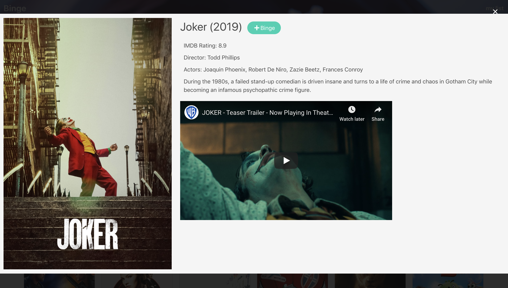
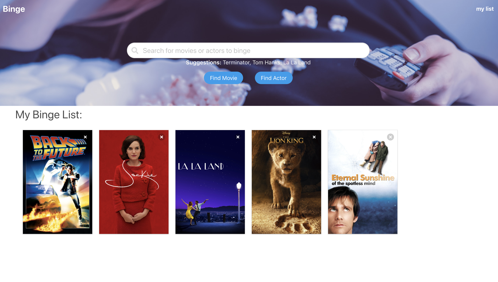

# Binge

## Description
Binge is  a full stack movie search and save to watch later web app. Once launched the user is welcomed to a page displaying the top trending movies based on iMDB results. The user can either click one of those movies, search for a specific movie or actor, or click their "List". Clicking on a movie will display the actors, director, plot, rating, a movie trailer (if available), and a button "+ Binge" which will add that movie to that user's own List. Searching for a specific movie will return movies matching the search query displayed in a similar fashion as the trending page. Searching for an actor will display movies that actor has starred in, also displayed in a similar grid as trending and a movie search.

<a href="http://sleepy-waters-84015.herokuapp.com/"> Click here </a> to check out a live demo hosted on Heroku.

## Technologies inside
- HTML 5
- CSS
- Bulma
- JavaScript
- jQuery
- AJAX
- Node.js
- Express.js
- Handlebars.js
- Sequelize
- mySQL

## How it works
When a movie is clicked jQuery makes an AJAX call to one of 2 different APIs (OMDB or TMDB) then returns results based on that click. jQuery then displays the pertinent info on the html Handlebars page. Based on the route chosen, Express routes the user to different pages including an API route. jQuery posts each movie as a jSON object to the api/movies route, Sequelize then makes a post request to the movies database for each object (movie) stored on the relational database. Once on the "my list" route when the user clicks the X close button on a movie Sequelize makes a delete request to the movie database, removing the movies store on the database. Handlebars and the HTML update in realtime. 

## Images

### Home Page
- 

### Movie View
- 

### My List View
- 

